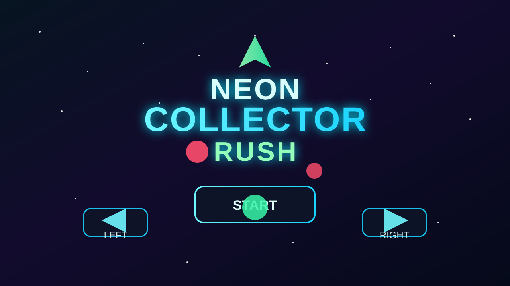
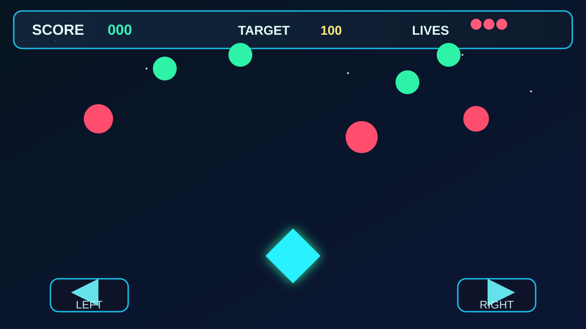
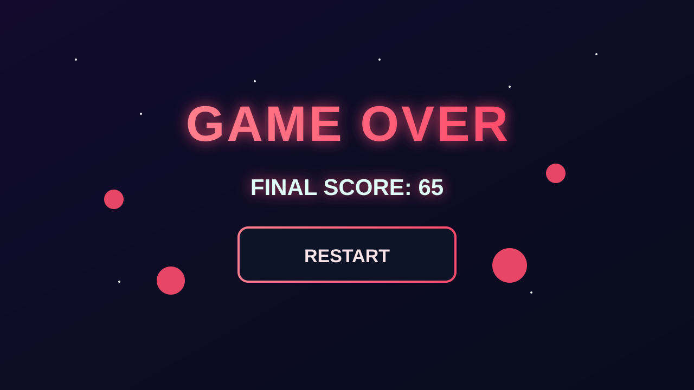

Neon Collector Rush
====================

Brief description
-
Neon Collector Rush is a small responsive 2D arcade game built with Phaser 3. The player controls a triangular ship that moves left/right to collect green crystals (+10 points each) and avoid red meteors. Reach 100 points to win; lose all lives to get a game over.

Controls
-
- Keyboard: Left/Right arrow keys.
- Touch / Click: On-screen left/right buttons at the bottom.

Install & run locally
-
From the project root (`neon-collector-rush/neon-collector-rush`):

```bash
npm install
npm start
```

Open the game in your browser at:

- Development: http://localhost:5173/

Screenshots
-
### Home screen



### Gameplay



### End screen



To create a production build and serve it locally:

```bash
npm run build
npx serve -s dist -l 5174
```

Then open: http://localhost:5174/

Notes
-
- The project uses Vite and Phaser 3.
- Generated textures are created at runtime in `src/scenes/BootScene.js` to ensure shapes appear correctly even if base64 assets fail to load.
- Base64-embedded assets (simple SVGs) are kept in `src/assets/base64Assets.js` as a fallback and for portability.

Assumptions, trade-offs & improvements
-
Assumptions
- The playable should be lightweight (<5 MB) and run locally in modern browsers.
- Assets are minimal procedural graphics or small base64 SVGs to keep size down.

Trade-offs
- I used generated textures and small SVGs rather than richer art to keep the bundle under the size target and avoid external dependencies.
- I used simple physics and groups; more advanced pooling or object recycling could improve performance.

Improvements (if more time)
- Add sound effects (base64-embedded small OGG/MP3) and music with mute toggle.
- Add animated sprites and particle effects for polish.
- Implement object pooling to reduce GC and allow higher spawn rates.
- Add difficulty scaling and a persistent high-score table (localStorage).
- Add more levels and visual polish (parallax background, UI animations).

Assets & License
-
- All assets in this project are either procedurally generated at runtime or are simple SVG shapes embedded as base64 in `src/assets/base64Assets.js` which were authored for this project.
- You may reuse the code and generated assets under MIT-style terms (no explicit license file included). If you want a formal license file added, I can add one.

Project structure pointers
-
- `index.html` — main entry.
- `src/main.js` — Phaser game bootstrap (exposes `window.game` for debugging).
- `src/config.js` — Phaser config (scaling/physics/scenes).
- `src/scenes/BootScene.js` — loads assets and generates runtime textures.
- `src/scenes/MenuScene.js`, `src/scenes/GameScene.js`, `src/scenes/EndScene.js` — game scenes.
- `src/objects/` — object classes for the player (and original Meteor/Crystal classes).
- `src/assets/base64Assets.js` — base64 SVG fallbacks.

How I tested
-
- `npm start` (Vite dev server) and played in desktop Chrome.
- `npm run build` to produce `dist`; build artifact is ~1.5 MB (single JS bundle ~1.48 MB minified).

If you'd like I can:
- Add a formal `LICENSE` (MIT).
- Produce an optimized smaller build (code-splitting or removing development-only code).
- Package the playable as a single HTML file (inlining JS) suitable for upload to HTML5 portals.

Enjoy — tell me if you want further polish or a packaged build for distribution.
